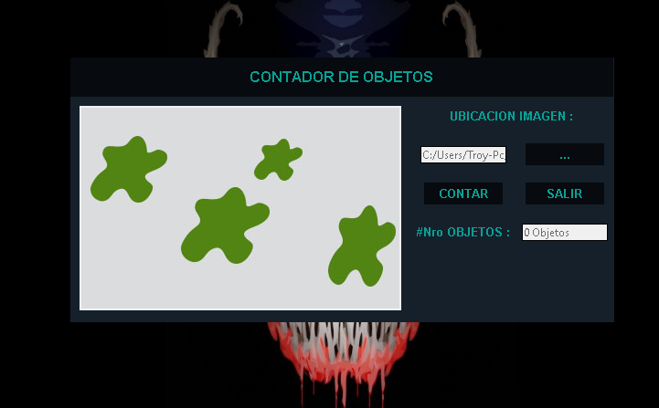

## Projecto OpenCv
created by Roy Ayala
Primero ejecutaremos main.py y automaticamente el programa se abrira
 
una vez ejecuta el programa , podremos abrir diversas imagenes pero 
se recomienda las imagenes que se encuentran en la carpeta imagenes
.Para abrir las imagenes presione el Boton "..."

Ahora selecciones una de nuestras imagenes (el programa soporta formatos como .jpg y .png)

una vez seleccionado la imagen podemos dar clic en el boton "CONTAR" y este automaticamente 
contara cuantos objetos se encuentran en la imagen

y luego encerrara los objetos contados.Para salir del programa solo presione el boton "SALIR"
#Muchas gracias